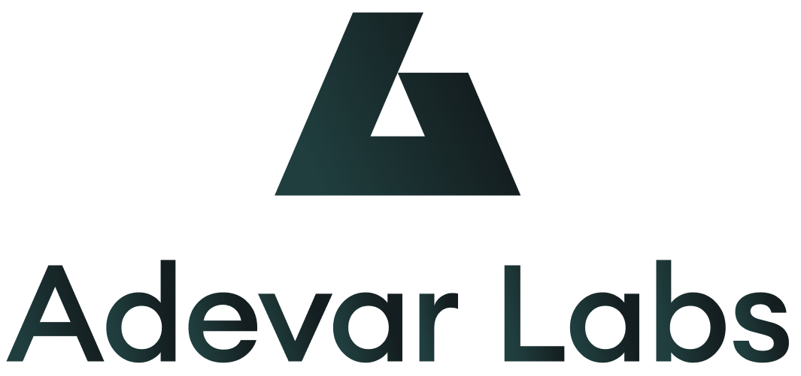

# 🛡️ Adevar Labs Public Security Assessment Reports

  

  <i>Ship Safely.</i>

---

> Welcome to the official repository of public security audit reports conducted by **Adevar Labs**. At our core, we believe that transparency is fundamental to building a more secure digital ecosystem. This repository serves as a public archive of the security assessments we have performed.

> **Important:** All reports published here are done so with the full consent and approval of our clients. We are grateful for their commitment to security and transparency.

## Repository Structure

To maintain clarity and ease of access, all reports use the following naming structure: `YYYY-MM-DD_Project-Name_audit_report.pdf`

Each report is a point-in-time assessment. For the most current status of any project, please refer directly to the project's official communication channels.

##  How to Read Our Reports

Our audit reports are designed to be comprehensive and clear. A typical report includes:

* **Executive Summary:** A high-level overview of the audit's scope and key findings. This section also includes a detailed breakdown of the specific contracts, commits, or components that were in scope for the assessment.
* **Assumptions & Considerations:** A set of assumptions made by the project designers, or by the security researchers while auditing the project. These include both design and security considerations and trust assumptions.
* **Findings:** A list of all discovered vulnerabilities, categorized by severity (e.g., `Critical`, `High`, `Medium`, or `Low`). Each finding includes a description and fix recommendation.
* **Enhancements:** A list of enhancement opportunities that have no security implications (e.g., optimizations).

## ⚠️ Disclaimer

The information in the audit reports is provided "as is" and is based on the scope and timeline outlined within each individual report. The findings represent a snapshot in time and do not guarantee the future security of any project. Adevar Labs is not liable for any security incidents or losses that may occur. An audit is not an endorsement or a guarantee of a project's overall security posture.

## 📬 About Adevar Labs & Contact

**Adevar Labs** is a boutique web3 security firm specializing in white-box code reviews for Rust, Move and Solidity. We help projects ship safely by checking their security posture before launching something in production.

Interested in having your project audited by our team of experts?

* **Request a Quote:** [Request Form](https://www.adevarlabs.com/request-audit)
* **Contact Us:** on [Telegram](https://t.me/adevarlabs)
* **Follow us on X (Twitter):** [@AdevarLabs](https://twitter.com/AdevarLabs) 
* **Connect on LinkedIn:** [AdevarLabs](https://www.linkedin.com/company/adevarlabs)

---

  © Adevar Labs Inc. All Rights Reserved.

